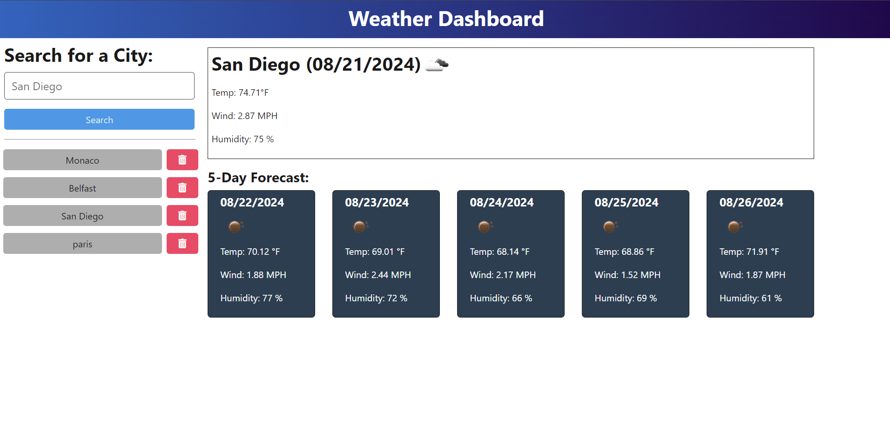

# Weather Dashboard

## Description

The project was made to provide a response from the Open Weather API to a weather dashboard. It provides the user with a 5-day weather report as well as city search history. The project generates a response from any given city, which it converts to coordinates. During this assignment, I learned how to generate an API key, store the key and base URL to a .env file, pass the env file securely using the dotenv package, construct a to use API documentation, and make an API call.

View the project at: https://weather-dashboard-wuv2.onrender.com.

## Table of Contents

- [Installation](#installation)
- [Usage](#usage)
- [License](#license)
- [Contributing](#contributing)
- [Tests](#tests)
- [Questions](#questions)

## Installation

1. Open a terminal or command prompt.
2. Navigate to the directory where the package is located.
3. Run “npm install” to install the package and its dependencies.

## Usage

1. Navigate to the application URL (or enter "npm run start" in the terminal).
2. Enter the city name under "Search for a City".
3. Select "Search".
4. View the forecast.
5. Select or delete the city search history.

## License

This project is licensed under the MIT license.

## Contributing

- Author:
  [Rory Dowse](https://github.com/RoryDowse).

- Third-party assets:  
  [OpenWeather Documentation](https://openweathermap.org/forecast5)  
  [Coding Bootcap](https://coding-boot-camp.github.io/full-stack/apis/how-to-use-api-keys)  
  [Render Deployment Guide](https://coding-boot-camp.github.io/full-stack/render/render-deployment-guide)  
  [Render Environment Variables](https://docs.render.com/configure-environment-variables)

- Other:

I would like to thank EdX TA James Harding, EdX tutor Eric Sayer, and EdX classmate Ian Ferguson for their guidance during the development of this project.

## Tests

1. Unit Tests   
   API Key and URL: Verify correct loading and usage of API keys and URLs. 
   City Conversion: Test the conversion of city names to geographic coordinates. 
   API Response Handling: Validate parsing and formatting of weather data from the API. 
   Search History: Ensure accurate addition, retrieval, and storage of cities in searchHistory.json.

2. Integration Tests   
   API Endpoints: 
   GET /api/weather/history: Confirm it returns saved cities. 
   POST /api/weather: Check city addition and weather data retrieval. 
   DELETE /api/weather/history/:id: Verify city removal functionality (if implemented). 
   Frontend-Backend Integration: Ensure the frontend correctly interacts with the backend for city searches and displays weather data.

3. End-to-End Tests   
   User Flows: Simulate user actions like searching for cities, viewing weather, and managing search history to ensure expected outcomes. 
   UI/UX: Test interface elements for correctness and responsiveness.

4. Deployment Tests   
   Live Application: Confirm the deployed app on Render is functional and accessible. 
   CI/CD: Ensure automated tests run and deployments are successful.

## Questions

Please visit my GitHub profile: https://github.com/RoryDowse. 
For additional questions, please contact me at: rorydowse@hotmail.com.
